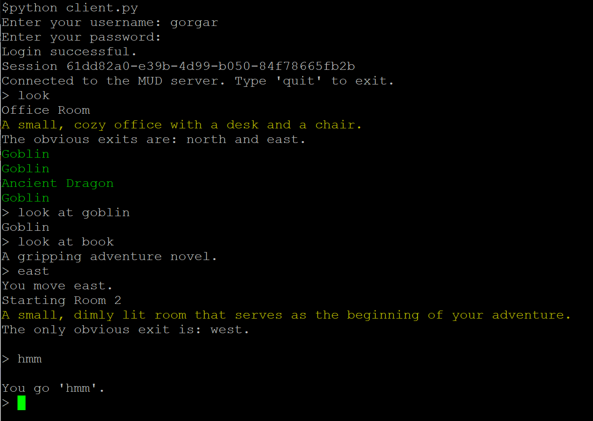

# GMud

## Introduction

Welcome to GMud, a modern take on the classic Multi-User Dungeon (MUD) experience. The 'G' in GMud stands out for several reasons:

1. **gRPC-Based Architecture**: At its core, GMud utilizes gRPC, a high-performance, open-source universal RPC framework, to handle network communication. This choice ensures a robust and efficient networking layer.
2. **Inspired by ChatGPT**: The design and development of GMud are heavily influenced by the capabilities of ChatGPT, particularly in areas of natural language understanding and interaction.
3. **Authored by 'Gorgar'**: GMud is a passion project of mine, Gorgar – a long-time MUD enthusiast and the admin of Dragonfire MUD. My experience and love for MUD games have been the driving force behind this project.

## Getting Started

This code was tested in python 3.9 and 3.7.5.

$./server.sh
Server started, listening on port 50051.

## Project Vision

The purpose of GMud is to craft a MUD library that encapsulates the essence of traditional MUD games while embracing modern technology and security practices. GMud is designed with a clear separation between the core game code and the content creation (building) process.

### For Builders
- **Lua Integration**: Builders can use Lua, a powerful, efficient, and lightweight scripting language, to create and modify game content. This integration allows for a controlled and secure way to access the underlying mudlib functions, which are written in Python.

### For Developers
- **Python and gRPC**: The core game logic of GMud is written in Python, leveraging the multi-threading capabilities of the language and gRPC. This combination brings numerous benefits, including:
    - **Concurrency and Scalability**: Python's multi-threading capabilities, coupled with gRPC's efficient handling of client-server communications, ensure that GMud can handle multiple simultaneous interactions smoothly.
    - **Speed**: gRPC's use of HTTP/2 brings significant improvements in speed and performance over traditional communication protocols used in MUDs.
    - **Security**: With gRPC, there is an inherent improvement in security, especially when compared to the unencrypted nature of Telnet, the traditional protocol for MUDs. gRPC allows for secure communication channels, which is a critical aspect of modern online gaming.

# Current Project Status

## Scoping and Proof of Concept

GMud is currently in the early stages of development, focusing on scoping and creating a proof of concept. Our efforts so far have been towards laying the groundwork for what we believe could be a revolutionary approach to MUD gaming. 

### Gathering Feedback

One of our immediate priorities is to gather feedback from the community. We are keen on understanding the perspectives and insights of MUD experts and enthusiasts alike. Their feedback is crucial in shaping the future direction of GMud.

### Will It Sink or Float?

At this stage, a key question we're exploring is: Will this new approach to MUD gaming sink or float? We're in the process of determining the viability and potential of GMud, and whether it stands up to scrutiny by seasoned MUD players and developers.

## Acknowledging the Roots

While GMud is not intended to replace traditional LP-style MUD drivers, it's essential to recognize the added benefits this modern approach brings. GMud bridges the gap between the nostalgic charm of MUDs and the advancements in networking, scripting, and security.

## Collaborate and Contribute

GMud is an open project, and collaboration is key to its growth and success. Whether you're a seasoned MUD enthusiast, a developer with an interest in game design, or someone passionate about scripting and world-building, your contributions are welcome. Together, we can continue to evolve GMud and keep the spirit of MUD gaming alive and thriving in the modern era.

---

Join us in this journey to redefine MUD gaming. Let's create something extraordinary together!

---

For more information, visit [GMud Repository](https://github.com/wedsall/GMud).

---

*GMud – Merging Tradition with Modern Innovation.*

